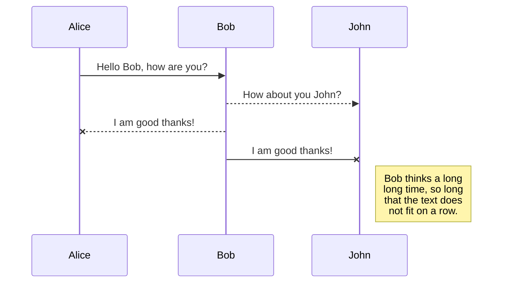
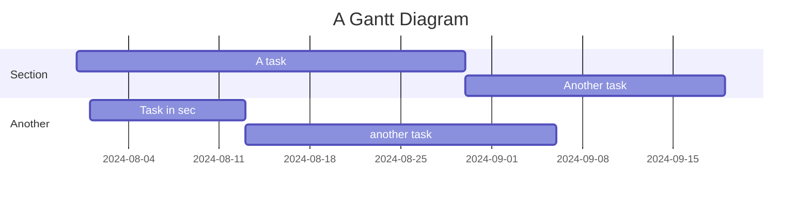
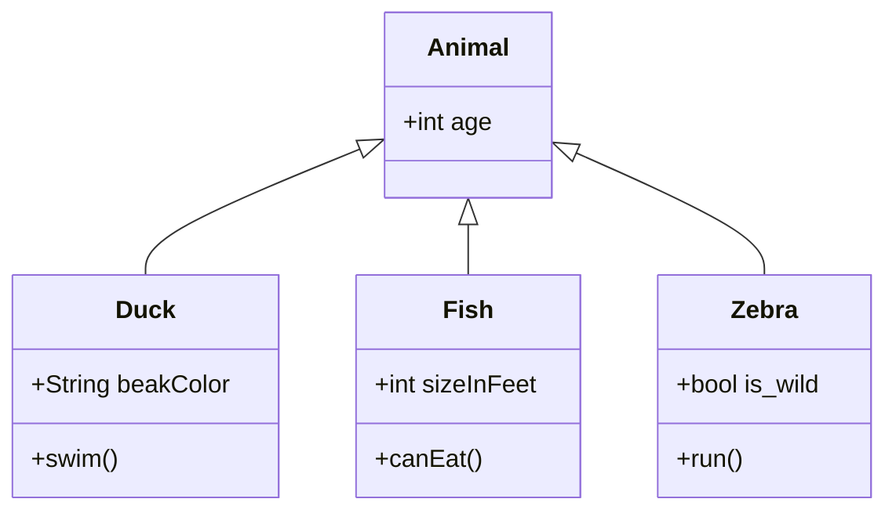

## toc

# Cheatsheet for Writing New Posts

Welcome to this concise cheatsheet designed to summarize the essential markdown syntax for writing effective blog posts. This guide serves as a quick reference for both new and experienced bloggers.

## Adding Images

Embed images to enhance your content and engage readers visually:

```markdown
 <!-- w=300 desc="Image generated by [Dall-E 3](https://openai.com/dall-e-3/)" -->
```

 <!-- w=300 desc="Image generated by [Dall-E 3](https://openai.com/dall-e-3/)" -->

## Adding Code Blocks

Incorporate code snippets to clarify technical explanations or showcase examples:

```python
def greet(name):
    print(f"Hello, {name}!")
```

```javascript
function isEven(num) {
  return num % 2 === 0;
}

// Testing the function
const num = 4;
if (isEven(num)) {
  console.log(`${num} is even.`);
} else {
  throw new Error('Wait, what?');
}
```

## Adding Links

Link to external sites or related pages to provide additional information:

```markdown
[Visit our website](https://example.com)
```

[Visit our website](https://example.com)

## Adding Lists

Organize information clearly with bulleted or numbered lists:

- Item 1
- Item 2

## Adding Blockquotes

Use blockquotes to highlight important quotes or content:

```markdown
> "The only way to do great work is to love what you do." - Steve Jobs
```

> "The only way to do great work is to love what you do." - Steve Jobs

## Adding Tables

Tables are useful for presenting data or comparative information neatly:

```markdown
| Name  | Age | Location | Info  |
|-------|:---:|:------|------:|
| Alice | 25  | New York |  None |
| Bob   | 30  | London   | None |
```

| Name  | Age | Location | Info  |
|-------|:---:|:------|------:|
| Alice | 25  | New York |  None |
| Bob   | 30  | London   | None |

## Adding Emphasis

Emphasize key points using bold, italic, or underlined text:

```markdown
**Bold Text**
*Italic Text*
***Bold and Italic Text***
~Strikethrough Text~  
<u>Underline Text</u>
<strike>Middle Line Text</strike>
<sup>Superscript Text</sup>
```

**Bold Text**  
*Italic Text*  
***Bold and Italic Text***  
~Strikethrough Text~  
<u>Underline Text</u>  
<strike>Middle Line Text</strike>  
<sup>Superscript Text</sup>  

## Adding Math Equations

Enhance scientific or academic posts with inline or block math equations:

```markdown
Both inline and block math equations are supported. Here is an example of an inline math equation: $E=mc^2$.

$$
PE(pos, 2i) = \sin(\frac{pos}{10000^{\frac{2i}{d_{\text{model}}}}})
$$

"```math
L = \frac{1}{2} \rho v^2 S C_L
```"
```

Both inline and block math equations are supported. Here is an example of an inline math equation: $E=mc^2$.

$$
PE(pos, 2i) = \sin(\frac{pos}{10000^{\frac{2i}{d_{\text{model}}}}})
$$


## Mermaid

Mermaid is a diagramming and charting tool that enables you to create flowcharts, sequence diagrams, Gantt diagrams, and more. Here are some examples:

### Flowchart

```md
graph TD;
    A-->B;
    A-->C;
    B-->D;
    C-->D;
```


### Sequence Diagram

```md
sequenceDiagram
    Alice->>Bob: Hello Bob, how are you?
    Bob-->>John: How about you John?
    Bob--x Alice: I am good thanks!
    Bob-x John: I am good thanks!
    Note right of John: Bob thinks a long<br/>long time, so long<br/>that the text does<br/>not fit on a row.
```



### Gantt Diagram

```md
gantt
    title A Gantt Diagram
    dateFormat  YYYY-MM-DD
    section Section
    A task           :a1, 2024-07-31, 30d
    Another task     :after a1  , 20d
    section Another
    Task in sec      :2024-08-01  , 12d
    another task     : 24d
```



### Class Diagram

```md
classDiagram
    Animal <|-- Duck
    Animal <|-- Fish
    Animal <|-- Zebra
    Animal : +int age
    Animal
    class Duck{
        +String beakColor
        +swim()
    }
    class Fish{
        +int sizeInFeet
        +canEat()
    }
    class Zebra{
        +bool is_wild
        +run()
    }
```



## Conclusion

This guide provides a foundation for using Markdown to create visually appealing and structurally sound blog posts. Happy blogging!
